# ESS 배터리 수명 예측

**울산캠퍼스 1반 김진형 · 개인 과제**

## 목적

MIT–Stanford 배터리 데이터의 초기 100사이클 신호를 이용해 셀의 총수명 `cycle_life`를 예측한다. 수명이 종료될 때까지 기다리지 않고 초기 전기적 변화에서 장기 열화 정보를 찾고, 배치와 충전 조건이 달라졌을 때 예측이 얼마나 유지되는지 확인하는 것이 목적이다.

전기전자공학 관점에서는 전압·전류·용량·내부저항·온도가 배터리의 상태를 나타내는 계측값이라는 점에 주목했다. 이 정보를 바탕으로 회귀 모델을 개발하고, 결과를 BMS의 상태 추정, PCS의 충전 제어, EMS의 점검·교체 판단과 연결해 해석했다.

### 주요 결과

최종 모델은 **ElasticNet / discharge**이며, 입력 후보 4개 중 초기 QD 기울기의 계수는 0으로 축소되었다.
Batch 1 그룹 CV MAPE는 **7.72 ± 2.56%**, 별도 hold-out은 **7.21%**다.
지정 Batch 2의 MAPE는 **43.45%**, 추가 Batch 3은 **11.71%**로, 내부 성능이 외부 배치에서 그대로 유지되지 않았다.

내부 검증에서는 작은 오차를 보였지만 지정 Batch 2에서는 수명을 과대 예측하는 문제가 나타났다. 따라서 초기 열화 신호의 유용성과 함께, 실험 조건이 바뀌었을 때의 일반화 한계를 분석했다.

## 목차

1. [프로젝트 개요](#프로젝트-개요)
2. [파일 구조](#파일-구조)
3. [환경 설정](#환경-설정)
4. [EDA](#eda)
5. [Modeling](#modeling)
6. [성능 결과](#성능-결과)
7. [오류 분석](#오류-분석)
8. [ESS 도메인 해석](#ess-도메인-해석)
9. [후기](#후기)
10. [한계와 개선 방향](#한계와-개선-방향)
11. [참고문헌](#참고문헌)
12. [팀 구성](#팀-구성)

## 프로젝트 개요

| 항목 | 내용 |
| --- | --- |
| 데이터셋 | MIT–Stanford Battery Dataset, Severson et al. (2019) |
| 학습 배치 | Batch 1: `2017-05-12` |
| 필수 외부 평가 | Batch 2: `2018-02-20` |
| 추가 외부 평가 | Batch 3: `2018-04-12` |
| 태스크 | Regression: 배터리 총수명 예측 |
| 타깃 | 원본 제공 `cycle_life`, 단위는 사이클 |
| 관측 범위 | 초기 100사이클 중 유효한 2–100사이클; ΔQ는 100−10 |
| 학습 타깃 변환 | log10 변환 후 학습, `10**예측값`으로 복원 |
| 주 평가지표 | 원래 사이클 단위의 MAPE(%) |
| 보조 평가지표 | MAE, RMSE, R², 평균 편향 |

### 분석 대상과 전처리 기준

원본은 Batch 1·2·3 각각 46·47·46개, 총 139개 셀이다. EOL 관측 여부, 수명 레이블 결측 및 공개 저자 로더의 노이즈 기준을 적용한 분석 대상은 각각 36·39·40개, 총 115개다.

| 배치 | 원본 셀 | 분석 셀 | 제외 기준 |
| --- | ---: | ---: | --- |
| Batch 1 | 46 | 36 | 수명 종료 미관측 10개; 이 중 5개는 과제 파일에 후속 연장 기록이 없음 |
| Batch 2 | 47 | 39 | `cycle_life` 결측 8개 |
| Batch 3 | 46 | 40 | 공개 저자 로더의 노이즈 기준 6개 |

공칭 용량 1.1Ah의 80%는 0.88Ah다. 미완료 기록을 판별할 때 마지막 QD 0.885Ah를 허용 기준으로 사용했으며, 정답 수명을 새로 추정하거나 다른 파일의 수명으로 덮어쓰지 않았다. 수명이 짧다는 이유로 셀을 제외하지 않았다. 제외 기준은 장수명 학습 표본을 제한할 수 있으므로 결과의 해석 범위에 포함했다.

ΔQ는 원본이 제공하는 실제 `Vdlin` 격자(3.5→2.0V, 1,000점)에서 계산했다. 정책 문자열의 `newstructure`는 원자료 표기를 유지하고, 추가 실험 자료 없이 구체적인 의미를 단정하지 않았다. 출처·처리 기준과 제외 셀은 [데이터 설명](data/README.md), [셀별 제외 기록](results/cell_exclusions.csv)에 정리했다.

## 파일 구조

```text
.
├── data/
│   ├── README.md                  데이터 출처와 처리 기준
│   ├── processed/                 분석 셀, 사이클 요약, 초기 원시 신호
│   ├── source_manifest.json       원본 출처·파일 해시
│   └── processed_manifest.json    가공 입력의 해시
├── notebooks/
│   ├── 01_EDA.ipynb
│   ├── 02_feature_engineering.ipynb
│   └── 03_modeling.ipynb
├── src/
│   ├── preprocess.py              입력 범위·셀·정책 분리 검증
│   ├── features.py                초기 피처 생성
│   ├── train.py                   후보 비교·튜닝·학습·평가
│   ├── evaluate.py                오류·분포 차이 분석
│   └── transforms.py              타깃 변환
├── models/
│   └── final_model.joblib
├── results/
│   ├── model_performance.csv      요구 성능표
│   ├── cv_comparison.csv          전체 17개 후보 비교
│   ├── predictions.csv            기준 모델과 최종 모델의 셀별 예측
│   ├── selection.json             최종 선택·적합 기록
│   └── figures/                   EDA 및 모델 분석 그래프 15개
├── docs/
│   ├── DAY2_분석보고서.md
│   ├── DAY2_분석보고서.pdf
│   ├── 모델_탐색_및_피처_정의.md
│   └── 전략_구현_연결.md
├── scripts/                       원본 처리·문서 생성·결과 검증
├── tests/                         입력·정책 분리·미래 정보 누출 테스트
├── requirements.txt
└── README.md
```

## 환경 설정

Python 3.11에서 실행했다. 가공 데이터가 저장소에 포함되어 있어 대용량 원본을 다시 내려받지 않고 학습·평가를 재현할 수 있다.

```bash
git clone https://github.com/a40427216-tech/ess-battery-project.git
cd ess-battery-project
python3.11 -m venv .venv
source .venv/bin/activate
pip install -r requirements.txt
python -m src.train
python -m src.evaluate
```

피처 생성과 후보 모델 학습은 `src.train`, 저장 모델의 오류·분포 분석은 `src.evaluate`에서 수행한다. 추가 검증과 노트북 실행은 다음과 같다.

```bash
python scripts/audit_design.py
python scripts/execute_notebooks.py
python -m unittest discover -s tests -v
python scripts/validate_results.py
```

원본부터 다시 처리하는 절차는 [data/README.md](data/README.md)에 정리했다. 노트북 3개는 실제 계산과 저장 모델 재평가 결과를 포함하며, 분석 결과를 순서대로 확인할 수 있다.

## EDA

### Cycle Life 분포


| 배치 | 셀 수 | 평균 | 중앙값 | 최솟값 | 최댓값 | <500 비율(%) | >1000 비율(%) |
| --- | --- | --- | --- | --- | --- | --- | --- |
| 1 | 36 | 788.42 | 772.50 | 534.00 | 1074.00 | 0.00 | 13.89 |
| 2 | 39 | 565.74 | 472.00 | 392.00 | 1186.00 | 71.79 | 7.69 |
| 3 | 40 | 1032.00 | 964.50 | 541.00 | 1935.00 | 0.00 | 47.50 |

단수명은 500사이클 미만, 장수명은 1,000사이클 초과로 구분했다. Batch 1에는 단수명 셀이 없지만 Batch 2는 39개 중 28개(71.8%)가 단수명이다. Batch 3은 40개 중 19개(47.5%)가 장수명이다. 수명 중앙값도 Batch 1 772.5, Batch 2 472.0, Batch 3 964.5사이클로 다르다.

**해석:** Batch 2는 학습 배치보다 짧은 수명이 많고 Batch 3은 긴 수명이 많다. 전체 평균 오차만 보면 특정 수명 구간의 실패를 놓칠 수 있으므로 배치별 성능과 수명 구간별 오류를 함께 확인해야 한다. Batch 1의 미완료 기록 제외는 장수명 표본을 줄이는 선택 편향을 만든다.

**모델 전략:** Batch 1 내부 검증과 외부 배치 평가를 구분하고, Batch 2·3의 오류를 학습 수명 범위와 연결해 분석한다.

### 열화 곡선 분석


전체 곡선에서는 수명 말기에 용량 감소가 빨라지는 셀이 관측된다. 반면 초기 100사이클에는 용량이 증가하거나 변화가 작은 셀도 많다. 2–100사이클 구간의 용량 증가 비율은 Batch 1 88.9%, Batch 2 64.1%, Batch 3 85.0%다. 초기 QD 절대값만으로 장·단수명을 구분하기는 어렵다.

Batch 2의 초기 QD 수준이 다른 배치보다 높은데도 총수명은 짧은 셀이 많다. 따라서 초기 용량이 높다는 사실을 장수명으로 바로 연결할 수 없다. 급격한 초기 변동은 계측·시험 조건과 함께 검토해야 하며 곡선만으로 특정 열화 원인을 확정하지 않았다.

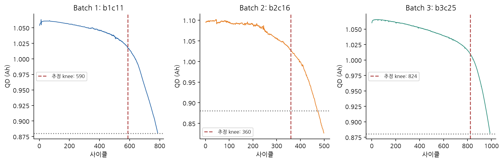

전체 유효 QD 기록을 구간별 선형 모델로 근사한 탐색적 knee의 중앙값은 Batch 1 **579.0**, Batch 2 **340.6**, Batch 3 **796.6사이클**이다. Batch 2에서는 가속 열화 구간이 상대적으로 일찍 나타나고, Batch 3에서는 늦게 나타나는 경향을 확인했다.

**해석:** knee는 전체 곡선을 본 뒤 계산한 사후 지표다. 초기 100사이클만으로 해당 시점을 안정적으로 알 수 있다고 볼 수 없으며, 구간별 근사로 얻은 값이 물리적으로 확정된 knee와 같다고 주장하지 않는다.

**모델 전략:** 초기 QD와 변화 기울기는 후보로 사용하되, 미래 knee·전체 기록 길이·마지막 QD는 입력에서 제외한다.

### ΔQ(V) 곡선 분석

```text
ΔQ(V) = Qdlin_cycle100(V) − Qdlin_cycle10(V)
분산 피처 = log10(Var(ΔQ, ddof=1))
최솟값 피처 = min(ΔQ − median(ΔQ))
```


중앙값을 뺀 ΔQ 곡선에서 장수명 셀은 상대적으로 변화 폭이 작고, Batch 2의 단수명 셀은 큰 변화를 보이는 경우가 많다. 전압에 따른 곡선 형태를 함께 보면 초기 용량 하나보다 열화 차이를 더 구체적으로 살펴볼 수 있다.

Batch 1·3에는 500사이클 미만 셀이 없으므로 두 배치 안에서 단수명과 장수명을 직접 비교한 것으로 해석하지 않았다. 중심화는 상수 용량 오프셋만 제거하며 전압축·곡선 모양·실험 시작 조건의 차이를 모두 보정하는 처리는 아니다.

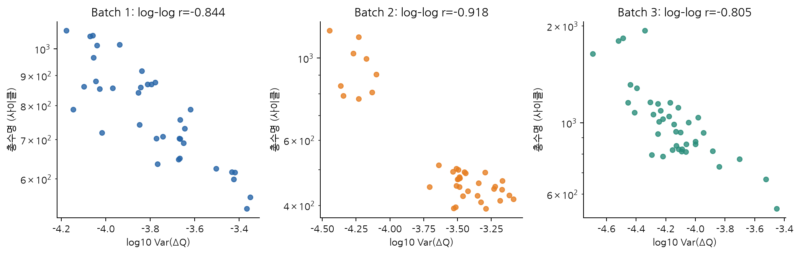

ΔQ 로그 분산과 로그 수명의 Pearson 상관계수는 Batch 1 **−0.844**, Batch 2 **−0.918**, Batch 3 **−0.805**다. 초기 곡선 변화가 큰 셀이 짧은 수명을 갖는 관계가 세 배치에서 관측됐다.

**모델 전략:** ΔQ 로그 분산을 기본 피처로 선택하고, 단일 피처 선형 모델을 기준선으로 둔다. 중심화 최솟값 등 다른 초기 방전 정보를 추가했을 때 개발 CV가 개선되는지 비교한다. 상관계수는 설명 신호의 근거이며 외부 예측 성능을 대신하지 않는다.

### 충전 속도(C-rate)와 수명의 관계

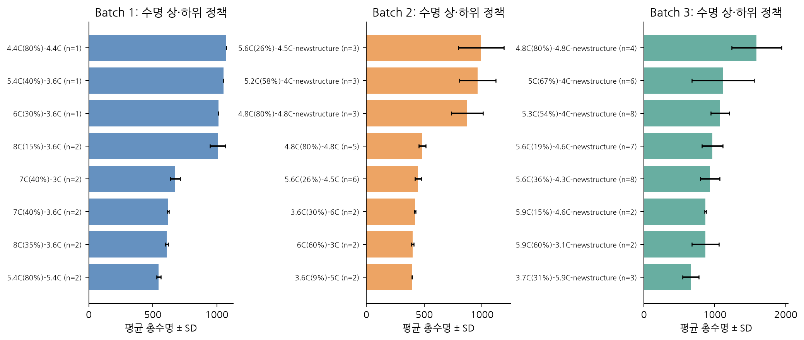

Batch 1에서 `8C(15%)-3.6C`의 평균 수명은 1,008.5사이클, `8C(35%)-3.6C`는 607.5사이클이다(각 n=2). 최대 C-rate가 같아도 고전류가 지속되는 SOC 구간과 이후 전류 단계가 다르면 수명이 달라질 수 있음을 보여준다.

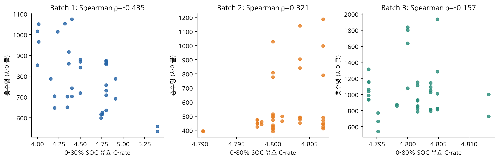

0–80% SOC 구간의 정책 기반 유효 C-rate와 수명의 Spearman 상관은 Batch 1 -0.435, Batch 2 +0.321, Batch 3 -0.157이다. Batch 2는 양의 상관으로 다른 두 배치와 방향이 다르므로, 충전 속도만으로 수명을 일률적으로 설명할 수 없다. Batch 2·3의 유효 C-rate 범위가 좁아 단일 수치로는 정책별 수명 차이를 충분히 설명하기 어렵다.

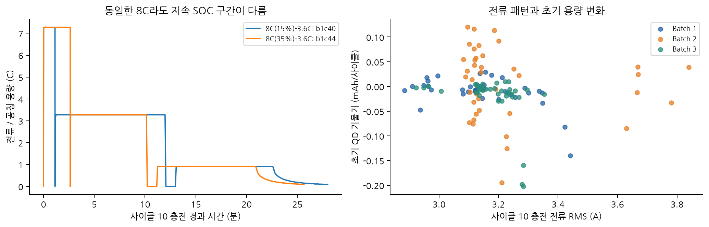

실제 사이클 10의 전류를 보면 같은 8C 정책에서도 고전류 구간이 유지되는 시간이 다르다. 전류의 RMS와 초기 QD 기울기 역시 배치별로 다른 분포를 보인다. 정책 문자열과 실측 파형은 각각 사전 설정과 실제 응답 정보를 제공한다.

**전기전자공학 해석:** 저항 손실은 `P_loss=I²R`로 전류에 민감하지만, 충전 정책별 평균 수명 차이를 I²R 손실 하나의 인과 효과로 설명할 수는 없다. SOC 구간·온도·셀 조건도 함께 달라지고 정책당 표본도 적다.

**모델 전략:** 첫·둘째 C-rate와 전환 SOC를 후보로 구성하고, 실측 충전 전류 RMS 및 평균 IR을 이용한 손실 대리값도 비교한다. 같은 정책의 셀이 훈련·검증에 동시에 들어가지 않도록 정책 그룹 분리를 적용한다.

### 추가 확인한 내용: 피처 상관관계와 다중공선성

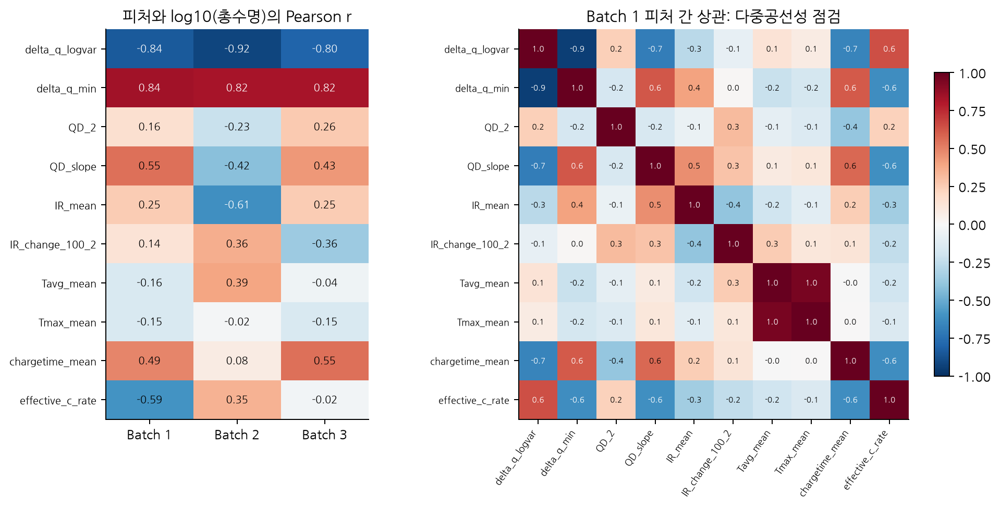

Batch 1에서 Tavg–Tmax 상관은 0.953, ΔQ 로그 분산–중심화 최솟값 상관은 −0.944로 중복 정보가 크다. 물리적으로 의미 있는 변수를 모두 추가하는 것이 항상 예측에 도움이 되지는 않으므로 대표 변수와 규제 모델을 비교했다.

최종 방전 피처와 로그 수명의 Pearson 상관은 다음과 같다.

| 피처 | Batch 1 | Batch 2 | Batch 3 |
| --- | --- | --- | --- |
| QD_2 | 0.157 | -0.225 | 0.259 |
| QD_slope | 0.552 | -0.420 | 0.431 |
| delta_q_logvar | -0.844 | -0.918 | -0.805 |
| delta_q_min | 0.837 | 0.823 | 0.825 |

ΔQ 관련 피처의 관계는 비교적 일관되지만 초기 QD와 수명의 상관 방향은 배치에 따라 달라진다. **피처가 학습 배치에서 유용하다는 사실과 새로운 배치에서도 같은 관계가 유지된다는 사실을 구분해야 한다.**

## Modeling

### 피처 엔지니어링 전략

| EDA에서 확인한 내용 | 피처 설계 | 검증할 가설 |
| --- | --- | --- |
| ΔQ 변화와 수명의 강한 관계 | `delta_q_logvar`, `delta_q_min` | 초기 방전 곡선의 변화가 총수명 예측에 유용한가? |
| 초기 QD와 변화 추세의 차이 | `QD_2`, `QD_slope` | 곡선 변화에 초기 용량·기울기를 추가하면 개선되는가? |
| 저항·온도·충전 시간의 물리적 의미 | `IR_mean`, `IR_change_100_2`, `Tavg_mean`, `chargetime_mean` | 전기적 상태·운전 응답이 추가 정보를 제공하는가? |
| 충전 정책별 수명 차이 | `c_rate_1`, `c_rate_2`, `switch_soc` | 사전 충전 조건의 추가 가치가 있는가? |
| 동일 C-rate에서도 실측 파형이 다름 | `charge_I_rms_c10`, `heat_proxy_c10_J` | 실제 전류와 손실 대리값이 정책 표기 이상의 정보를 주는가? |

| 피처 집합 | 입력 수 | 구성 |
| --- | ---: | --- |
| variance | 1 | ΔQ 로그 분산 |
| discharge | 4 | ΔQ 로그 분산·중심화 최솟값·QD_2·QD 기울기 |
| state | 8 | discharge + IR 평균·변화, 평균 온도, 충전 시간 |
| policy | 11 | state + 첫·둘째 C-rate, 전환 SOC |
| current | 10 | state + 사이클 10 전류 RMS, I²R 적분 손실 대리값 |

ΔQ 분산 단독 → 방전 피처 4개 → 저항·온도·충전 시간 8개 → 정책 포함 11개 → 실측 전류·손실 대리값 포함 10개를 비교했다.

공통 방전 피처는 `delta_q_logvar`, 중앙값 중심화 `delta_q_min`, `QD_2`, `QD_slope`다.
`QD_slope`는 2–100사이클의 유효 QD로 계산한다. IR≤0, 비현실적 온도, 비양수 충전 시간은 결측으로 처리한다.
ΔQ 분산은 제공 Qdlin의 사이클 100−10 차이에 표본 분산(ddof=1)을 적용하며, 중앙값 중심화는 분산을 바꾸지 않는다.
저항·온도·전류 피처를 추가한 모델이 이번 개발 CV에서 항상 개선되지는 않았다. 이는 해당 물리량이 중요하지 않다는 뜻이 아니라, 소표본에서 추가 정보와 중복·불안정성이 함께 존재한다는 뜻이다.

최종 선택된 `discharge`의 정의는 다음과 같다.

| 피처 | 계산과 의미 | 단위 |
| --- | --- | --- |
| `delta_q_logvar` | 실제 전압 격자에서 ΔQ100−10의 표본 분산을 log10 변환 | log10(Ah² / 1Ah²) |
| `delta_q_min` | 중앙값 중심화 ΔQ 곡선의 최솟값 | Ah |
| `QD_2` | 실제 2번 사이클의 방전 용량 | Ah |
| `QD_slope` | 2–100사이클 유효 QD를 사이클 번호에 대해 선형 근사한 기울기 | Ah/cycle |

중앙값 중심화는 ΔQ의 상수 오프셋을 제거하지만 분산은 바꾸지 않는다. 결측 대체는 해당 학습 fold의 중앙값으로 수행한다. 타깃·셀 ID·배치 ID·전체 관측 길이·말기 용량·미래 knee는 모델의 입력 허용 목록에 없다. [피처 구현](src/features.py)과 [전체 정의·탐색 격자](docs/모델_탐색_및_피처_정의.md)에 계산 기준을 정리했다.

### 모델 선택 및 근거

| 후보 계열 | 비교 목적 |
| --- | --- |
| 중앙값 기준 | 초기 신호 없이 총수명 중앙값만 예측하는 기본 수준 확인 |
| ΔQ 단일 선형 기준 | 핵심 초기 신호 하나만으로 얻는 성능 확인 |
| Ridge | 상관이 강한 피처를 L2 규제로 안정화 |
| ElasticNet | L1/L2 규제로 중복 피처와 소표본 복잡도를 통제 |
| RBF SVR | 초기 신호와 수명 사이의 비선형 관계 비교 |
| 얕은 Random Forest | 제한된 분기와 상호작용으로 비선형 후보 비교 |

ΔQ 피처의 강한 상관과 소표본을 고려해 규제 선형 모델을 중심에 두고 비선형 후보를 비교했다. 각 계열은 지정한 피처 집합과 조합해 총 17개 후보로 구성했다. 모델·피처 조합은 개발 CV 평균 MAPE의 최솟값으로 선택하고, 하이퍼파라미터는 안쪽 정책 그룹 CV에서 탐색했다.

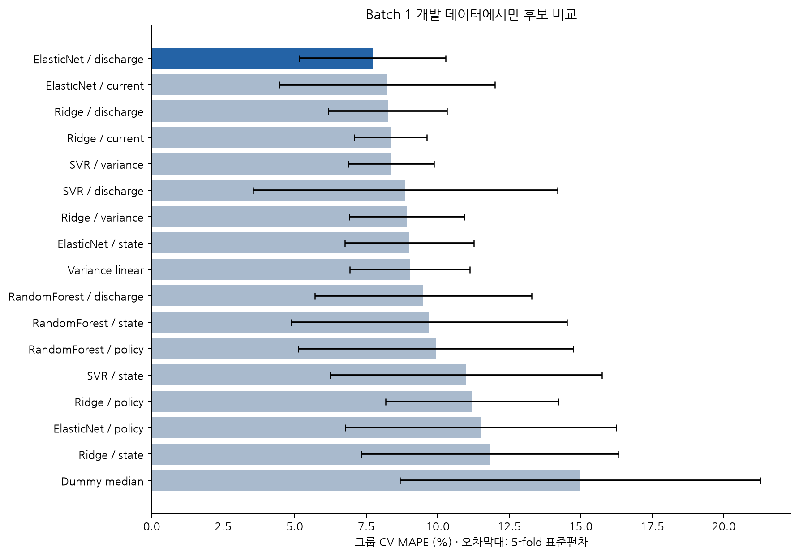

| 모델·피처 집합 | 피처 수 | CV 평균 MAPE(%) | 표준편차(%) |
| --- | --- | --- | --- |
| ElasticNet / discharge | 4 | 7.72 | 2.56 |
| ElasticNet / current | 10 | 8.24 | 3.76 |
| Ridge / discharge | 4 | 8.25 | 2.07 |
| Ridge / current | 10 | 8.35 | 1.27 |
| SVR / variance | 1 | 8.38 | 1.49 |
| SVR / discharge | 4 | 8.87 | 5.32 |
| Ridge / variance | 1 | 8.93 | 2.01 |
| ElasticNet / state | 8 | 9.00 | 2.25 |
| Variance linear | 1 | 9.03 | 2.10 |
| RandomForest / discharge | 4 | 9.49 | 3.79 |
| RandomForest / state | 8 | 9.69 | 4.82 |
| RandomForest / policy | 11 | 9.94 | 4.81 |
| SVR / state | 8 | 10.99 | 4.75 |
| Ridge / policy | 11 | 11.20 | 3.02 |
| ElasticNet / policy | 11 | 11.51 | 4.73 |
| Ridge / state | 8 | 11.82 | 4.50 |
| Dummy median | 1 | 14.99 | 6.30 |

**최종 모델은 ElasticNet / discharge**다. CV MAPE가 7.72%로 가장 낮았으며, 최종 하이퍼파라미터는 `alpha=0.01`, `l1_ratio=0.5`다. 복잡한 피처 집합보다 방전 피처 4개가 개발 CV에서 좋은 결과를 보였다. 다만 Ridge / discharge의 8.25%와 차이는 약 0.53%p로 작아, 표준편차와 소표본을 고려하면 확실한 통계적 우월성을 입증한 결과는 아니다.

#### 정책 그룹 분리와 학습 파이프라인

```text
Batch 1 분석 셀 36개
├── 개발 28개 / 15개 충전 정책
│   ├── 바깥 5-fold GroupKFold: 후보 모델·피처 조합 비교
│   │   └── 안쪽 4-fold GroupKFold: 하이퍼파라미터 탐색
│   └── 개발 28개로 최종 튜닝·적합
└── hold-out 8개 / 5개 별도 충전 정책

동일한 최종 적합 모델 → hold-out / Batch 2 / Batch 3 평가
```

DAY 1에서 고정한 Batch 1의 정책 그룹 분리를 유지했다. 36개 중 개발 28개(15정책), hold-out 8개(5정책)이며 셀·정책 중복이 없다.

개발 부분의 바깥 5-fold 그룹 CV로 후보를 비교하고, 각 바깥 훈련 부분의 안쪽 4-fold 그룹 CV에서 하이퍼파라미터를 정한다.
결측 대체와 표준화도 Pipeline 안에 있으므로 안쪽·바깥쪽 모두 해당 훈련 부분에서만 적합한다.

최종 후보는 바깥 CV의 평균 MAPE로 선정하고, 개발 28개만으로 안쪽 그룹 CV 튜닝 후 적합한다. 같은 적합 모델을 hold-out·Batch 2·Batch 3에 적용한다.

모델 계열과 피처 집합을 바깥 CV에서 골랐으므로 선택된 CV 수치는 낙관적일 수 있다. 별도 hold-out이 이를 보완하지만 표본 8개·정책 5개로 작다.
세 배치를 DAY 1 EDA에서 살펴보았으므로 완전히 눈가림된 연구는 아니다. DAY 2 외부 결과로 모델·피처·하이퍼파라미터를 다시 선택하지 않았다.

#### 최종 모델의 계수 해석

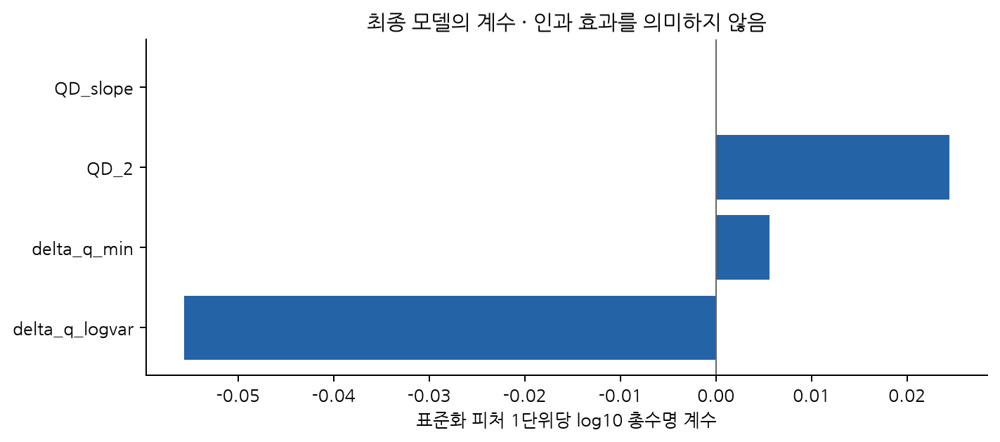

| feature | standardized_log10_coefficient |
| --- | --- |
| delta_q_logvar | -0.05564 |
| delta_q_min | 0.00561 |
| QD_2 | 0.02441 |
| QD_slope | 0.00000 |

계수는 표준화된 입력과 log10 총수명에 대한 값이다. ΔQ 로그 분산의 음의 계수는 초기 곡선 변화가 클수록 예측 수명이 짧아지는 방향이다. `QD_2`는 양의 계수이며, `QD_slope`는 L1 규제로 0이 되어 후보 입력 4개 중 실제 선형 기여는 3개다.

피처끼리 상관이 있으므로 계수의 크기를 독립적인 물리 중요도나 인과 효과로 해석하지 않았다. 특히 초기 QD의 양의 관계가 외부 배치에서도 유지되는지 오류 분석에서 따로 확인했다.

## 성능 결과

### 과제 요구 성능표

| 구분 | MAPE (%) 또는 Gap (%p) | 비고 |
| --- | --- | --- |
| Train (Batch 1 CV) | 7.72 | 정책 그룹 5-fold, 평균 ± 표준편차 7.720 ± 2.564% |
| Valid (Batch 1 Hold-out) | 7.21 | 개발 데이터와 정책이 겹치지 않는 8개 셀 |
| Test (Batch 2) | 43.45 | 과제 지정 2018-02-20, 39개 셀 |
| Gap (Train-Valid) | -0.51 | Valid − CV; 양수이면 내부 검증 오차 증가 |
| Gap (Valid-Test) | 36.25 | Batch 2 − Valid; 양수이면 외부 평가 오차 증가 |
| Gap (Target-Test) | 34.35 | Batch 2 − 9.1; 서로 다른 코호트·분리 조건의 참고 비교 |
| Test (Batch 3) | 11.71 | 추가 평가, 2018-04-12, 40개 셀 |
| Gap (Batch2-Batch3) | -31.74 | Batch 3 − Batch 2; 양수이면 Batch 3 오차가 더 큼 |
| Gap (Target-Test, Batch 3) | 2.61 | Batch 3 − 9.1; 논문 목표와의 참고 비교 |

MAPE는 `100 × mean(abs(실제−예측) / 실제)`로 계산한다. CV는 각 fold의 MAPE 평균이고 표준편차는 2.56%다. OOF 예측 전체를 합친 MAPE 7.63%는 fold 평균 7.72%와 집계 방식이 달라 약간 다르다.

Gap의 단위는 **%p**다. 양수가 뒤 평가의 오차 증가를 뜻하도록 다음과 같이 계산했다.

```text
Gap (Train–Valid) = Hold-out MAPE − CV 평균 MAPE
Gap (Valid–Test) = Batch 2 MAPE − Hold-out MAPE
Gap (Target–Test) = Batch 2 MAPE − 9.1
Gap (Batch 2–Batch 3) = Batch 3 MAPE − Batch 2 MAPE
```

Train–Valid Gap은 -0.51%p로 내부 검증 오차 증가가 관측되지 않았다. 다만 hold-out 8개만으로 과적합이 없다고 단정할 수 없다.
Valid–Test Gap은 +36.25%p로 Batch 2의 일반화 저하가 크고, 목표 대비 +34.35%p여서 9.1% 목표에 도달하지 못했다.
Batch 3−Batch 2는 -31.74%p지만 이 값이 음수라는 사실만으로 모든 배터리에 잘 일반화된다고 볼 수 없다.

### 실제 수명과 예측 수명

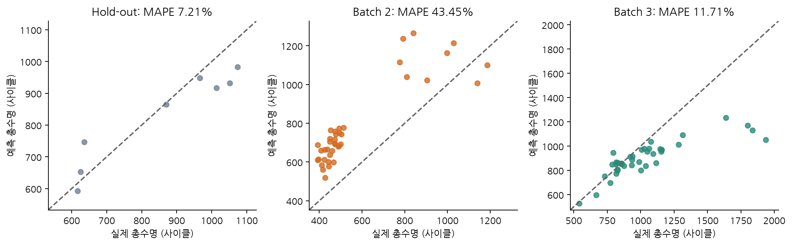

대각선에 가까울수록 실제 수명과 예측 수명이 일치한다. Hold-out에서는 비교적 대각선에 가깝지만 Batch 2의 단수명 셀은 대각선 위로 벗어나 과대 예측이 많다. Batch 3의 장수명 셀은 아래로 벗어나 과소 예측되는 경향을 보인다. 서로 다른 배치에서 같은 방향과 크기의 오차가 나타나는 것은 아니다.

| 평가 | 셀 수 | MAE(사이클) | RMSE(사이클) | R² | 평균 편향(사이클) |
| --- | --- | --- | --- | --- | --- |
| Hold-out | 8 | 61.63 | 75.51 | 0.84 | -27.05 |
| Batch 2 | 39 | 222.39 | 235.18 | -0.15 | 211.12 |
| Batch 3 | 40 | 148.59 | 243.36 | 0.36 | -130.27 |

MAE는 평균적으로 몇 사이클을 틀렸는지, RMSE는 큰 오류의 영향을, 평균 편향은 과대·과소 예측 방향을 나타낸다. Batch 2의 R²는 약 −0.15로, 해당 평가 집단의 실제 평균을 사용하는 사후 기준보다 제곱오차가 크다. 이 사후 평균은 모델 학습이나 운영 예측에 사용하지 않았다.

### 단일 피처·중앙값 기준과 비교


| 모델 | Hold-out | Batch 2 | Batch 3 |
| --- | --- | --- | --- |
| Dummy median | 22.56 | 55.38 | 24.75 |
| ElasticNet / discharge | 7.21 | 43.45 | 11.71 |
| Variance linear | 9.29 | 29.90 | 11.60 |

최종 모델의 Batch 2 MAPE 43.45%는 중앙값 기준 55.38%보다 낮지만, ΔQ 분산 단일 피처 선형 기준 29.90%보다 높다.
Batch 3에서도 단일 피처 기준 11.60%가 최종 모델 11.71%보다 조금 낮다.
이는 “개발 CV에서 가장 좋은 후보가 모든 외부 배치에서도 가장 좋다”는 가정을 반박한다. 외부 결과를 보고 최종 모델을 교체하면 평가 데이터가 선택에 사용되므로, 사전 선정 모델과 기준 모델의 결과를 그대로 함께 제시한다.

**해석:** 초기 용량 등 추가 정보가 내부 CV에서 도움을 주어도 외부 배치에서는 다른 관계를 만들 수 있다. 내부 최저 오차와 실제 현장 일반화를 구분하고, 간단한 기준 모델을 유지해 추가 피처의 가치를 확인하는 것이 필요하다.

## 오류 분석

### 가장 크게 틀린 셀과 오차 방향

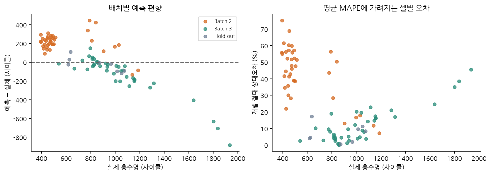

| 셀 | 평가 | 실제 수명 | 예측 수명 | 예측−실제 | 상대오차(%) |
| --- | --- | --- | --- | --- | --- |
| b2c6 | Batch 2 | 393.00 | 688.49 | 295.49 | 75.19 |
| b2c29 | Batch 2 | 452.00 | 763.15 | 311.15 | 68.84 |
| b2c21 | Batch 2 | 408.00 | 659.19 | 251.19 | 61.57 |
| b3c38 | Batch 3 | 1935.00 | 1052.50 | -882.50 | 45.61 |
| b3c7 | Batch 3 | 1836.00 | 1129.51 | -706.49 | 38.48 |
| b3c45 | Batch 3 | 1801.00 | 1169.17 | -631.83 | 35.08 |

Batch 2의 큰 오류 사례는 실제 수명이 393·452·408사이클인 단수명 셀이다. 예를 들어 b2c6는 실제 393사이클을 약 688사이클로 예측해 상대오차가 75.19%다. Batch 3의 큰 오류 사례는 실제 수명이 1,801–1,935사이클인 장수명 셀이다. 두 배치의 실패 방향을 따로 해석해야 한다.

Batch 2에서는 **39개 중 37개**를 과대 예측했고 평균 편향은 **+211.1사이클**이다. 500사이클 미만 28개 셀의 MAPE는 48.22%다.

개발 셀의 초기 QD 평균은 1.0773Ah지만 Batch 2는 1.0935Ah로 높다(개발 표준편차 기준 +1.86).
최종 모델의 QD_2 계수는 양수라 높은 초기 용량은 예측 수명을 늘리는 방향으로 작용한다. 그러나 Batch 2에서 초기 QD와 로그 수명의 상관은 -0.225로, Batch 1의 +0.157과 다르다.
이 표본에서는 초기 용량과 수명의 상관 방향이 배치마다 다르게 관측됐다. 조건 이동과 좁은 학습 수명 범위도 원인 후보이며, 센서 교정이나 열화 기작의 인과 효과를 입증한 것은 아니다.

Batch 3의 평균 편향은 **-130.3사이클**이다. 1,000사이클 초과 19개 셀은 모두 과소 예측했고 해당 구간 MAPE는 18.55%다.
가장 큰 사례는 b3c38로 실제 1,935사이클을 약 1,052사이클로 예측했다. 장수명 학습 표본의 부족과 규제에 따른 예측 범위 축소가 원인 후보이며, 개별 요인의 효과를 분리해 확인한 결과는 아니다.

### 피처 분포 변화와 원인 가설

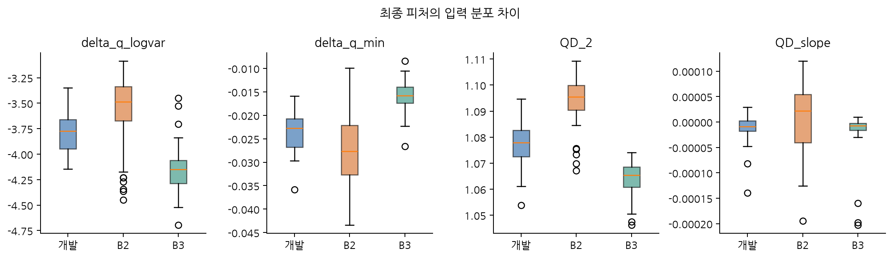

개발 셀의 초기 QD 평균은 1.0773Ah, Batch 2는 1.0935Ah다. Batch 2의 초기 용량이 개발 표준편차 기준 약 +1.86만큼 높아 최종 모델의 양의 QD 계수는 예측 수명을 늘리는 방향으로 작용한다. 그러나 QD와 로그 수명의 상관은 Batch 1 +0.157, Batch 2 −0.225로 방향이 다르다.

**원인 가설:** 초기 절대 용량의 배치 의존성, 학습 표본의 좁은 수명 범위, 충전·계측·셀 조건의 차이가 함께 영향을 주었을 가능성이 있다. 이 분석은 오류와 입력 분포의 관계를 보여 주지만 특정 센서 오차나 열화 기작의 인과 효과를 입증하지 않는다.

### 학습 수명 범위 안·밖 평가

개발 셀의 실제 수명 범위는 534–1,054사이클이다.

| 평가 | 실제 수명 구간 | 셀 수 | MAPE (%) | 평균 편향(사이클) |
| --- | --- | --- | --- | --- |
| Batch 2 | 범위 안 | 7 | 32.34 | 272.36 |
| Batch 2 | 범위 밖 | 32 | 45.89 | 197.73 |
| Batch 3 | 범위 안 | 26 | 6.66 | -31.19 |
| Batch 3 | 범위 밖 | 14 | 21.09 | -314.28 |

Batch 2는 범위 안의 7개 셀도 MAPE 32.34%로 오차가 크다. 따라서 단수명 외삽만으로 실패를 설명하기 어렵다. Batch 3은 범위 안 26개에서 6.66%, 범위 밖 14개에서 21.09%로 장수명 외삽의 오차가 커진다.

이 구분은 실제 정답을 아는 평가 후 진단이다. 실제 수명을 미리 알아야 하는 분류 규칙을 모델 입력이나 현장 선별 조건으로 사용하지 않았다.

### 개선 방향

1. 단수명·장수명과 다양한 운전 조건을 포함하는 학습 자료를 확보해 학습 범위를 넓힌다.
2. 초기 절대 QD의 배치 의존성을 점검하고, 변화 기반 피처와 센서 교정의 영향을 새 검증 집단에서 비교한다.
3. 동일 정책·동일 배치에서만 낮은 오차가 나오는지 확인하고 외부 조건별 편향을 지속적으로 점검한다.
4. 점 예측에 불확실성 정보를 더하되, 새 현장에 대한 예측 구간을 별도 검증한다.

고정 모델의 정책 그룹 bootstrap 2,000회로 얻은 MAPE 범위는 hold-out 5.37–9.06%, Batch 2 36.10–49.87%, Batch 3 8.52–15.91%다. 이는 현재 표본의 변동을 근사한 범위이며 개별 셀의 예측 구간이나 새로운 현장의 오차 보장이 아니다.

## ESS 도메인 해석

**BMS의 상태 추정:** 초기 용량이 크거나 SOH가 높다는 사실만으로 장수명을 보장할 수 없다. 용량·전압 곡선·저항·온도는 서로 다른 상태 정보를 제공한다. 총수명 예측, 현재 SOH, 출력 한계 SOP를 구분해야 한다.

**PCS의 충전 제어:** 전류 프로파일과 SOC 구간은 I²R 손실과 상태 응답에 연결된다. 이번 상관분석은 충전 전략 가설을 만드는 근거이며, 고속 충전의 인과 효과나 최적 정책을 입증하지 않는다. 실측 전류와 평균 저항의 ∫I²Rdt는 손실 대리값으로 실제 총발열 측정값과 구분했다.

**EMS의 유지보수 판단:** Batch 2에서 수명을 과대 예측한 결과는 교체 일정을 지나치게 늦출 수 있는 오차 방향을 보여 준다. 모델 출력은 점검 우선순위 검토에 활용하되 BMS의 전압·온도 보호 조건과 함께 판단해야 한다. 용량 기반 EOL 예측 오차를 화재 위험 예측 성능으로 해석할 수 없다.

**셀에서 팩으로의 확장:** 셀 평균만으로 팩 전체 수명을 판단하기 어렵다. 직렬 연결에서 약한 셀, 냉각 편차, 저항·용량 불균형과 밸런싱이 운전 한계에 영향을 준다. 실제 팩·ESS 데이터의 별도 검증이 필요하다.

**현장 적용 조건:** 실험실 고속 충전 데이터와 실제 ESS의 부분 충·방전, 휴지, 온도 변화, SOC 체류 및 달력 열화는 다르다. 현장에서 ΔQ(V)를 안정적으로 산출할 수 있는지, 센서 오차와 운전 범위 변화가 예측에 미치는 영향을 먼저 확인해야 한다.

### 실제 BESS 의사결정에 연결

| 분석 결과 | 활용 가능한 판단 | 적용 전 필요한 확인 |
| --- | --- | --- |
| 초기 곡선 변화와 총수명의 관계 | 점검 우선순위, 상태 진단에 참고할 조기 열화 신호 | 현장 부분 충·방전에서 ΔQ 산출 가능 여부 |
| Batch 2에서 수명 과대 예측 | 교체 판단을 모델 한 개에만 맡기는 위험 점검 | 운전 조건별 편향과 보호·정비 기준 |
| 전류 패턴·SOC 구간의 차이 | PCS 충전 정책을 비교할 가설 수립 | 제어 조건을 분리한 실험, 온도·효율·수명 공동 검증 |
| 장수명 셀의 과소 예측 | 불필요한 조기 교체 비용을 고려한 보수성 점검 | 장수명 학습·현장 검증 자료, 불확실성 |
| 셀별 용량·저항 차이 | 팩의 약한 셀·밸런싱·냉각 편차 점검 | 팩·모듈·ESS 운전 데이터의 별도 평가 |

총수명 예측은 현재 SOH나 즉시 가능한 출력 SOP의 추정과 목적이 다르다. 예측 모델을 배터리의 전압·온도 보호 제어와 구분하고, 전기적 보호와 운전 기준을 함께 적용하는 것이 중요하다.

## 후기

이번 과제는 SKALA 수업에서 처음으로 전기전자공학 전공과 연결해 진행한 데이터 분석 과제라 특히 흥미로웠다. 전압·전류·용량·저항·온도처럼 전공에서 다루는 신호가 실제 배터리 수명 분석에 어떻게 활용되는지 직접 살펴볼 수 있었다. 전공 지식과 데이터 분석을 함께 사용하면서 공학 문제를 이해하는 또 다른 방법을 경험했다.

DAY 1에서는 ΔQ 분산과 수명의 강한 관계를 보고 예측에 유용할 것이라고 생각했다. 실제 모델을 평가하니 내부 CV와 hold-out에서는 오차가 작았지만, 지정 Batch 2에서는 오차가 크게 증가했다. 상관계수가 높다는 것과 새로운 조건에서 모델이 정확하다는 것은 별도로 확인해야 한다는 점을 배웠다.

초기 용량을 추가하면 내부 검증이 개선됐지만 외부 배치에서는 단일 피처 기준보다 오차가 커진 점도 인상적이었다. 물리적으로 의미 있는 변수라도 학습 데이터에서 관측한 관계가 다른 조건에서 그대로 유지되는 것은 아니었다. 계측값의 정의와 배치 조건을 확인하고, 피처를 늘리는 이유를 성능과 함께 검증하는 습관이 중요하다고 느꼈다.

전기전자공학 관점에서는 평균 오차뿐 아니라 오차 방향을 보는 일이 중요했다. 수명을 길게 예측하면 유지보수 판단이 늦어질 수 있고, 짧게 예측하면 불필요한 교체로 이어질 수 있다. 모델은 전기적 보호 제어를 대신하는 것이 아니라, 상태 추정과 점검 판단을 보완하는 도구로 이해해야 한다고 생각했다.

앞으로 SKALA 수업에서도 전공과 연결된 데이터를 분석할 기회가 더 많아졌으면 좋겠다. 배터리뿐 아니라 전력·에너지 분야의 다양한 데이터를 다루며, 전공 지식을 실제 문제에 적용하고 데이터로 판단하는 경험을 더 쌓고 싶다.

## 한계와 개선 방향

분석 대상은 EOL 관측·수명 레이블·데이터 품질 기준을 충족한 115개 셀이다. Batch 1의 연장 기록과 EOL 미관측 셀 10개를 제외해 장수명 학습 표본이 제한된다. 결측 수명을 추정값으로 채우거나 논문의 다른 배치를 과제 Batch 2로 대체하지 않았다.

Batch 2의 `newstructure`는 원자료의 정책 표기를 유지했으며, 구체적인 실험 의미는 추가 자료 없이 단정하지 않았다. 정책당 표본이 적고 온도·충전 조건이 함께 달라 상관으로 열화 원인을 분리할 수 없다.

Batch 3 중심화는 상수 용량 오프셋을 제거하는 처리이며 전압축·시점·곡선 모양의 차이까지 보정하지 않는다. 제공 Vdlin은 3.5→2.0V의 실제 격자를 사용했다. 전체 열화 곡선과 knee는 사후 설명용으로, 모델 입력에 사용하지 않았다.

논문의 MAPE 9.1%와는 시험 파일·표본 구성·학습 수·분리 방식이 다르다. 목표 대비 Gap은 과제 요구에 따른 참고 비교이며, 같은 조건의 재현 성능이라고 주장하지 않는다. 정책 그룹 bootstrap 범위는 고정 모델의 표본 변동만 근사하며, 개별 셀 예측 구간이나 새로운 현장의 오차 보장이 아니다.

후속 개선은 더 넓은 수명·운전 조건의 학습 자료를 확보하고 새 검증 집단을 정한 뒤 수행해야 한다. 초기 절대 용량의 배치 의존성, 변화 기반 피처, 센서 교정과 불확실성 추정을 검토할 수 있다. 이번 Batch 2 결과로 재튜닝한 모델을 같은 Batch 2에서 새 최종 성능으로 보고하지 않는다.

## 참고문헌

- [Severson et al. (2019), Data-driven prediction of battery cycle life before capacity degradation, Nature Energy 4, 383–391](https://www.nature.com/articles/s41560-019-0356-8)
- [과제 지정 MIT–Stanford 배터리 데이터 — Kaggle](https://www.kaggle.com/datasets/itshpark/data-driven-prediction-of-battery-cycle)
- [논문 저자 공개 데이터 로더](https://github.com/rdbraatz/data-driven-prediction-of-battery-cycle-life-before-capacity-degradation)
- [scikit-learn: GroupKFold](https://scikit-learn.org/stable/modules/generated/sklearn.model_selection.GroupKFold.html)
- [scikit-learn: Nested cross-validation](https://scikit-learn.org/stable/auto_examples/model_selection/plot_nested_cross_validation_iris.html)
- [scikit-learn: TransformedTargetRegressor](https://scikit-learn.org/stable/modules/generated/sklearn.compose.TransformedTargetRegressor.html)

## 팀 구성

김진형(울산캠퍼스 1반, 개인 과제): 데이터 분석, EDA, 피처 엔지니어링, 모델 개발, Batch 2·3 성능 평가, 오류 분석 및 보고서 작성.

[상세 분석보고서](docs/DAY2_분석보고서.md) · [분석보고서 PDF](docs/DAY2_분석보고서.pdf) · [피처 정의와 모델 탐색 근거](docs/모델_탐색_및_피처_정의.md)
