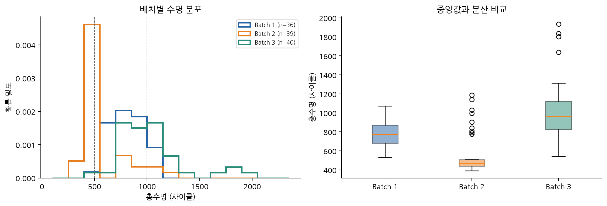
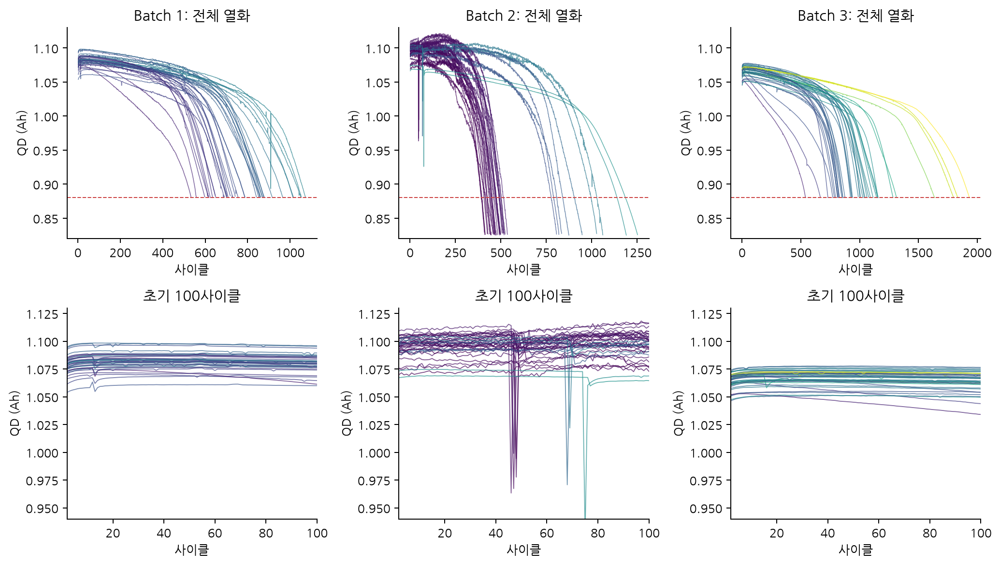
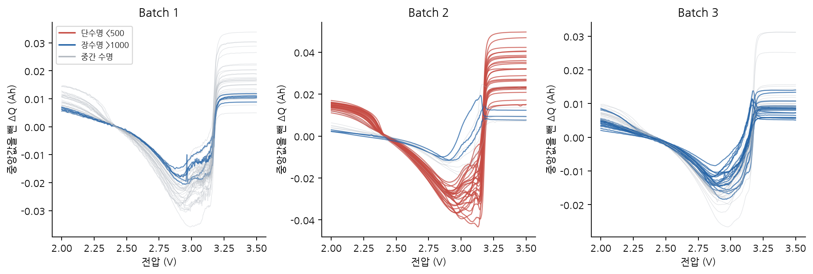
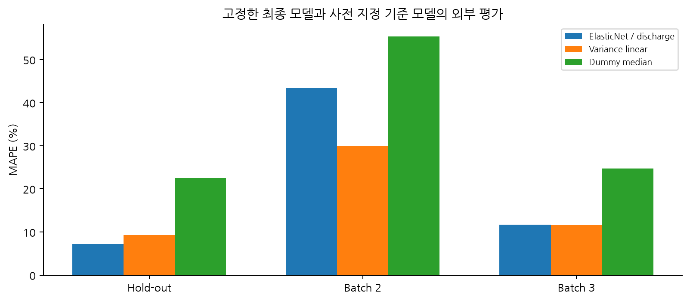

# ESS 배터리 수명 예측
## DAY 2 모델 개발 및 평가

**울산캠퍼스 1반 김진형 · 개인 과제**

작성일: 2026년 10월 2일

### 분석 목적

초기 100사이클의 신호로 배터리 총수명을 예측하는 회귀 모델을 개발하고, 지정 Batch 2와 추가 Batch 3에서 일반화 성능 및 ESS 운영 시사점을 확인한다.

### 주요 결과

최종 모델은 **ElasticNet / discharge**이며, 입력 후보 4개 중 초기 QD 기울기의 계수는 0으로 축소되었다.
Batch 1 그룹 CV MAPE는 **7.72 ± 2.56%**, 별도 hold-out은 **7.21%**다.
지정 Batch 2의 MAPE는 **43.45%**, 추가 Batch 3은 **11.71%**로, 내부 성능이 외부 배치에서 그대로 유지되지 않았다.

내부 성능만으로 배치 간 신뢰성을 판단하기 어렵다. Batch 2에서는 초기 용량 분포와 피처–수명 관계가 달라 과대 예측이 많았고, Batch 3에서는 장수명 셀의 과소 예측이 두드러졌다.

### 목차

2–4쪽: 데이터와 EDA / 5–6쪽: 피처·모델·검증 / 7쪽: 요구 성능표 / 8–9쪽: 기준 모델·오류·분포 차이 / 10–11쪽: 전공 시사점·후기 / 12쪽: 한계와 참고문헌 / 13쪽: 보완 지표와 학습 범위

<!-- PAGEBREAK -->

## 2. 데이터와 분석 대상

Kaggle에 공개된 세 원본 파일을 사용했다. Batch 2는 2018-02-20이며 논문의 2017-06-30 배치로 대체하지 않았다. 제공된 cycle_life를 타깃으로 유지했다.

| 배치 | 셀 수 | 평균 | 중앙값 | 최솟값 | 최댓값 | <500 비율(%) | >1000 비율(%) |
| --- | --- | --- | --- | --- | --- | --- | --- |
| 1 | 36 | 788.42 | 772.50 | 534.00 | 1074.00 | 0.00 | 13.89 |
| 2 | 39 | 565.74 | 472.00 | 392.00 | 1186.00 | 71.79 | 7.69 |
| 3 | 40 | 1032.00 | 964.50 | 541.00 | 1935.00 | 0.00 | 47.50 |

### 처리 기준

원본 139개 중 EOL 미관측·수명 결측·기존 노이즈 기준으로 115개를 분석했다. B1 46→36, B2 47→39, B3 46→40이다. B1 연장 기록이 없는 셀 5개와 별도 미완료 셀 5개를 제외했다. 이 기준은 장수명 표본을 제한하는 선택 편향을 만든다.

공칭 1.1Ah의 80%는 0.88Ah이다. 마지막 관측의 EOL 근접 판별에는 0.885Ah 허용 기준을 적용했다. 실제 사이클 번호와 원시 Qd 최대값을 대조해 배열 인덱스 혼동을 점검했다.

<!-- PAGEBREAK -->

## 3. 전체 열화와 초기 용량

### 초기 값과 미래 열화를 구분

초기 용량은 항상 감소하지 않는다. 2번 대비 100번 사이클 QD가 증가한 셀은 B1 88.9%, B2 64.1%, B3 85.0%다. 초기 용량 하나로 수명을 판단하거나 초기 기울기를 전 생애에 선형으로 연장하기 어렵다.

### 가속 열화와 knee

전체 QD에 이동 중앙값을 적용하고 단일 직선과 연속 구간별 직선의 오차를 비교해 knee 후보를 탐색했다. 말기의 감소 기울기가 더 크고 설명 오차가 충분히 줄어드는 경우를 남겼다. 이 분석은 사후 열화 설명이며 초기 100사이클 예측 피처로 사용하지 않는다.

### 설계 연결

초기 상태를 여러 신호로 요약하되 실제 EOL·knee·관측 길이를 입력에서 제외한다. 표본이 적으므로 강한 신호부터 시작하고 추가 피처의 효과를 검증한다.

<!-- PAGEBREAK -->

## 4. ΔQ·충전 조건·상관관계

### ΔQ(V)와 수명

제공된 실제 Vdlin 격자 3.5→2.0V에서 Q100−Q10을 계산했다. log 분산과 log 수명의 Pearson r은 B1 −0.844, B2 −0.918, B3 −0.805다. 중심화는 상수 오프셋만 제거하며 분산은 같다. 곡선 모양과 상태의 미세한 차이를 피처로 만든다.

### 충전 조건과 중복 신호

B1의 같은 8C 최대 전류라도 15% SOC까지 유지한 정책의 평균 수명은 1,008.5, 35%까지 유지한 정책은 607.5사이클이다(n=2). 실측 충전 RMS와 초기 QD 기울기의 상관은 B1 −0.499, B2 −0.112, B3 −0.379다. 동일 정책에서도 셀 편차가 있고 배치별 관계가 달라 충전 속도 하나로 수명을 설명하지 않는다.

B1 Tavg–Tmax의 r=0.953, ΔQ 로그 분산–중심화 최소의 r=−0.944다. 대표 온도 신호와 규제 모델을 사용하고, 관계를 인과로 단정하지 않는다.

<!-- PAGEBREAK -->

## 5. 피처 엔지니어링과 구현

ΔQ 분산 단독 → 방전 피처 4개 → 저항·온도·충전 시간 8개 → 정책 포함 11개 → 실측 전류·손실 대리값 포함 10개를 비교했다.

공통 방전 피처는 `delta_q_logvar`, 중앙값 중심화 `delta_q_min`, `QD_2`, `QD_slope`다.
`QD_slope`는 2–100사이클의 유효 QD로 계산한다. IR≤0, 비현실적 온도, 비양수 충전 시간은 결측으로 처리한다.
ΔQ 분산은 제공 Qdlin의 사이클 100−10 차이에 표본 분산(ddof=1)을 적용하며, 중앙값 중심화는 분산을 바꾸지 않는다.
저항·온도·전류 피처를 추가한 모델이 이번 개발 CV에서 항상 개선되지는 않았다. 이는 해당 물리량이 중요하지 않다는 뜻이 아니라, 소표본에서 추가 정보와 중복·불안정성이 함께 존재한다는 뜻이다.

| 피처 집합 | 입력 수 | 의미 |
| --- | --- | --- |
| variance | 1 | ΔQ 로그 분산 |
| discharge | 4 | 분산·중심화 최소·QD2·초기 QD 기울기 |
| state | 8 | 방전＋IR 평균·변화·Tavg·충전 시간 |
| policy | 11 | state＋C1·C2·전환 SOC |
| current | 10 | state＋충전 RMS·손실 대리값 |

### 파이프라인

셀 내부에서 초기 피처를 계산하고, 학습 부분의 중앙값으로 결측을 대체한다. 표준화·하이퍼파라미터 선택은 그룹 CV 안에서 수행한다. 회귀 타깃은 log10으로 변환하되 평가할 때 원래 사이클로 복원한다. 입력은 허용 목록으로 제한해 셀 ID·배치 ID·레이블·미래 요약값을 차단했다.

### 최종 모델의 계수

| feature | standardized_log10_coefficient |
| --- | --- |
| delta_q_logvar | -0.05564 |
| delta_q_min | 0.00561 |
| QD_2 | 0.02441 |
| QD_slope | 0.00000 |

규제 후 QD 기울기 계수는 0이며, 실제 예측에는 세 피처가 작용한다. 표준화 계수는 통계적 연관이고 전기화학적 인과 효과가 아니다.

<!-- PAGEBREAK -->

## 6. 후보 모델과 검증 전략

후보는 중앙값·단일 피처 선형 기준, Ridge, ElasticNet, RBF SVR, 얕은 Random Forest이다. 작은 표본과 중복 신호에는 규제를 적용하고 비선형 후보는 추가 개선 여부를 확인한다.

DAY 1에서 고정한 Batch 1의 정책 그룹 분리를 유지했다. 36개 중 개발 28개(15정책), hold-out 8개(5정책)이며 셀·정책 중복이 없다.

개발 부분의 바깥 5-fold 그룹 CV로 후보를 비교하고, 각 바깥 훈련 부분의 안쪽 4-fold 그룹 CV에서 하이퍼파라미터를 정한다.
결측 대체와 표준화도 Pipeline 안에 있으므로 안쪽·바깥쪽 모두 해당 훈련 부분에서만 적합한다.

최종 후보는 바깥 CV의 평균 MAPE로 선정하고, 개발 28개만으로 안쪽 그룹 CV 튜닝 후 적합한다. 같은 적합 모델을 hold-out·Batch 2·Batch 3에 적용한다.

모델 계열과 피처 집합을 바깥 CV에서 골랐으므로 선택된 CV 수치는 낙관적일 수 있다. 별도 hold-out이 이를 보완하지만 표본 8개·정책 5개로 작다.
세 배치를 DAY 1 EDA에서 살펴보았으므로 완전히 눈가림된 연구는 아니다. DAY 2 외부 결과로 모델·피처·하이퍼파라미터를 다시 선택하지 않았다.

### 개발 데이터에서의 상위 후보

| 모델 | 피처 수 | CV 평균 MAPE(%) | CV 표준편차(%) |
| --- | --- | --- | --- |
| ElasticNet / discharge | 4 | 7.72 | 2.56 |
| ElasticNet / current | 10 | 8.24 | 3.76 |
| Ridge / discharge | 4 | 8.25 | 2.07 |
| Ridge / current | 10 | 8.35 | 1.27 |
| SVR / variance | 1 | 8.38 | 1.49 |
| SVR / discharge | 4 | 8.87 | 5.32 |
| Ridge / variance | 1 | 8.93 | 2.01 |
| ElasticNet / state | 8 | 9.00 | 2.25 |

최종 후보는 ElasticNet / discharge이다. 개발 28개에서 그룹 CV로 alpha=0.01, l1_ratio=0.5를 정했다. 이 모델의 동일한 적합 상태를 모든 외부 평가에 유지했다.

<!-- PAGEBREAK -->

## 7. 요구 형식에 따른 성능 보고

| 구분 | MAPE (%) 또는 Gap (%p) | 비고 |
| --- | --- | --- |
| Train (Batch 1 CV) | 7.72 | 정책 그룹 5-fold, 평균 ± 표준편차 7.720 ± 2.564% |
| Valid (Batch 1 Hold-out) | 7.21 | 개발 데이터와 정책이 겹치지 않는 8개 셀 |
| Test (Batch 2) | 43.45 | 과제 지정 2018-02-20, 39개 셀 |
| Gap (Train-Valid) | -0.51 | Valid − CV; 양수이면 내부 검증 오차 증가 |
| Gap (Valid-Test) | 36.25 | Batch 2 − Valid; 양수이면 외부 평가 오차 증가 |
| Gap (Target-Test) | 34.35 | Batch 2 − 9.1; 서로 다른 코호트·분리 조건의 참고 비교 |
| Test (Batch 3) | 11.71 | 추가 평가, 2018-04-12, 40개 셀 |
| Gap (Batch2-Batch3) | -31.74 | Batch 3 − Batch 2; 양수이면 Batch 3 오차가 더 큼 |
| Gap (Target-Test, Batch 3) | 2.61 | Batch 3 − 9.1; 논문 목표와의 참고 비교 |

### 지표와 비교 조건

MAPE = mean(|실제−예측| / 실제) × 100이며 총수명이 분모다. RUL MAPE와는 다른 지표다. Train은 CV 검증 오차의 fold 평균이고 fold 크기가 달라 전체 OOF 평균 7.63%와 약간 다르다.

Gap은 표의 양수가 오차 증가를 뜻하도록 뒤 평가−앞 평가를 계산했다. 단위는 %p다. 내부 CV와 hold-out은 유사하지만 Batch 2의 오차가 크게 증가했다. Batch 3은 Batch 2보다 낮지만 9.1% 목표보다 높다.

논문과 파일 날짜·코호트·학습 표본·검증 방식이 달라 목표 대비 차이는 동일 조건 재현 성능이 아닌 참고 비교다.

<!-- PAGEBREAK -->

## 8. 기준 모델과 일반화 한계

| 모델 | Hold-out | Batch 2 | Batch 3 |
| --- | --- | --- | --- |
| Dummy median | 22.56 | 55.38 | 24.75 |
| ElasticNet / discharge | 7.21 | 43.45 | 11.71 |
| Variance linear | 9.29 | 29.90 | 11.60 |

최종 모델의 Batch 2 MAPE 43.45%는 중앙값 기준 55.38%보다 낮지만, ΔQ 분산 단일 피처 선형 기준 29.90%보다 높다.
Batch 3에서도 단일 피처 기준 11.60%가 최종 모델 11.71%보다 조금 낮다.
이는 “개발 CV에서 가장 좋은 후보가 모든 외부 배치에서도 가장 좋다”는 가정을 반박한다. 외부 결과를 보고 최종 모델을 교체하면 평가 데이터가 선택에 사용되므로, 사전 선정 모델과 기준 모델의 결과를 그대로 함께 제시한다.

### 해석

내부 검증에서 추가 피처가 개선됐다는 이유만으로 현장에서도 더 유리하다고 결론 내릴 수 없다. 데이터의 배치 조건과 피처 관계가 바뀌는 상황을 별도로 확인해야 한다. ElasticNet과 Ridge의 개발 CV 평균 차이는 약 0.53%p로 작아, 후보 간 통계적으로 확실한 우월성을 입증한 것은 아니다.

<!-- PAGEBREAK -->

## 9. 오류 사례와 입력 분포 차이

| 셀 | 평가 | 실제 수명 | 예측 수명 | 예측−실제 | 상대오차(%) |
| --- | --- | --- | --- | --- | --- |
| b2c6 | Batch 2 | 393.00 | 688.49 | 295.49 | 75.19 |
| b2c29 | Batch 2 | 452.00 | 763.15 | 311.15 | 68.84 |
| b2c21 | Batch 2 | 408.00 | 659.19 | 251.19 | 61.57 |
| b3c38 | Batch 3 | 1935.00 | 1052.50 | -882.50 | 45.61 |
| b3c7 | Batch 3 | 1836.00 | 1129.51 | -706.49 | 38.48 |
| b3c45 | Batch 3 | 1801.00 | 1169.17 | -631.83 | 35.08 |

Batch 2에서는 **39개 중 37개**를 과대 예측했고 평균 편향은 **+211.1사이클**이다. 500사이클 미만 28개 셀의 MAPE는 48.22%다.

개발 셀의 초기 QD 평균은 1.0773Ah지만 Batch 2는 1.0935Ah로 높다(개발 표준편차 기준 +1.86).
최종 모델의 QD_2 계수는 양수라 높은 초기 용량은 예측 수명을 늘리는 방향으로 작용한다. 그러나 Batch 2에서 초기 QD와 로그 수명의 상관은 -0.225로, Batch 1의 +0.157과 다르다.
이 표본에서는 초기 용량과 수명의 상관 방향이 배치마다 다르게 관측됐다. 조건 이동과 좁은 학습 수명 범위도 원인 후보이며, 센서 교정이나 열화 기작의 인과 효과를 입증한 것은 아니다.

Batch 3의 평균 편향은 **-130.3사이클**이다. 1,000사이클 초과 19개 셀은 모두 과소 예측했고 해당 구간 MAPE는 18.55%다.
가장 큰 사례는 b3c38로 실제 1,935사이클을 약 1,052사이클로 예측했다. 장수명 학습 표본의 부족과 규제에 따른 예측 범위 축소가 원인 후보이며, 개별 요인의 효과를 분리해 확인한 결과는 아니다.

### 불확실성

정책 그룹별 재표집 2,000회로 얻은 고정 모델 MAPE의 근사 95% 표본 변동 범위는 hold-out 5.37–9.06%, B2 36.10–49.87%, B3 8.52–15.91%다. 작은 그룹 수와 모델 선택·조건 이동의 불확실성을 모두 반영하지 않으며, 개별 셀의 예측 구간도 아니다.

<!-- PAGEBREAK -->

## 10. 전기전자공학과 ESS 운영 시사점

**BMS의 상태 추정:** 초기 용량이 크거나 SOH가 높다는 사실만으로 장수명을 보장할 수 없다. 용량·전압 곡선·저항·온도는 서로 다른 상태 정보를 제공한다. 총수명 예측, 현재 SOH, 출력 한계 SOP를 구분해야 한다.

**PCS의 충전 제어:** 전류 프로파일과 SOC 구간은 I²R 손실과 상태 응답에 연결된다. 이번 상관분석은 충전 전략 가설을 만드는 근거이며, 고속 충전의 인과 효과나 최적 정책을 입증하지 않는다. 실측 전류와 평균 저항의 ∫I²Rdt는 손실 대리값으로 실제 총발열 측정값과 구분했다.

**EMS의 유지보수 판단:** Batch 2에서 수명을 과대 예측한 결과는 교체 일정을 지나치게 늦출 수 있는 오차 방향을 보여 준다. 모델 출력은 점검 우선순위 검토에 활용하되 BMS의 전압·온도 보호 조건과 함께 판단해야 한다. 용량 기반 EOL 예측 오차를 화재 위험 예측 성능으로 해석할 수 없다.

**셀에서 팩으로의 확장:** 셀 평균만으로 팩 전체 수명을 판단하기 어렵다. 직렬 연결에서 약한 셀, 냉각 편차, 저항·용량 불균형과 밸런싱이 운전 한계에 영향을 준다. 실제 팩·ESS 데이터의 별도 검증이 필요하다.

**현장 적용 조건:** 실험실 고속 충전 데이터와 실제 ESS의 부분 충·방전, 휴지, 온도 변화, SOC 체류 및 달력 열화는 다르다. 현장에서 ΔQ(V)를 안정적으로 산출할 수 있는지, 센서 오차와 운전 범위 변화가 예측에 미치는 영향을 먼저 확인해야 한다.

### 이번 결과가 제시하는 판단 기준

내부 정확도뿐 아니라 외부 운전 조건, 과대·과소 예측의 방향, 센서 품질과 적용 범위를 함께 설명해야 한다. 유지보수 판단에 사용할 모델이라면 평균 오차가 낮은 것보다 어느 조건에서 실패하는지 아는 것이 중요하다.

<!-- PAGEBREAK -->

## 11. 분석을 통해 느낀 점

이번 과제는 SKALA 수업에서 처음으로 전기전자공학 전공과 연결해 진행한 데이터 분석 과제라 특히 흥미로웠다. 전압·전류·용량·저항·온도처럼 전공에서 다루는 신호가 실제 배터리 수명 분석에 어떻게 활용되는지 직접 살펴볼 수 있었다. 전공 지식과 데이터 분석을 함께 사용하면서 공학 문제를 이해하는 또 다른 방법을 경험했다.

DAY 1에서는 ΔQ 분산과 수명의 강한 관계를 보고 예측에 유용할 것이라고 생각했다. 실제 모델을 평가하니 내부 CV와 hold-out에서는 오차가 작았지만, 지정 Batch 2에서는 오차가 크게 증가했다. 상관계수가 높다는 것과 새로운 조건에서 모델이 정확하다는 것은 별도로 확인해야 한다는 점을 배웠다.

초기 용량을 추가하면 내부 검증이 개선됐지만 외부 배치에서는 단일 피처 기준보다 오차가 커진 점도 인상적이었다. 물리적으로 의미 있는 변수라도 학습 데이터에서 관측한 관계가 다른 조건에서 그대로 유지되는 것은 아니었다. 계측값의 정의와 배치 조건을 확인하고, 피처를 늘리는 이유를 성능과 함께 검증하는 습관이 중요하다고 느꼈다.

전기전자공학 관점에서는 평균 오차뿐 아니라 오차 방향을 보는 일이 중요했다. 수명을 길게 예측하면 유지보수 판단이 늦어질 수 있고, 짧게 예측하면 불필요한 교체로 이어질 수 있다. 모델은 전기적 보호 제어를 대신하는 것이 아니라, 상태 추정과 점검 판단을 보완하는 도구로 이해해야 한다고 생각했다.

앞으로 SKALA 수업에서도 전공과 연결된 데이터를 분석할 기회가 더 많아졌으면 좋겠다. 배터리뿐 아니라 전력·에너지 분야의 다양한 데이터를 다루며, 전공 지식을 실제 문제에 적용하고 데이터로 판단하는 경험을 더 쌓고 싶다.

### 다음에 확인하고 싶은 것

절대 초기 용량과 변화 기반 피처의 배치 의존성을 비교하고, 저항·온도·운전 조건이 더 다양한 자료에서 전기적 등가회로와 데이터 기반 수명 모델을 함께 검증해 보고 싶다.

<!-- PAGEBREAK -->

## 12. 한계와 참고문헌

분석 대상은 EOL 관측·수명 레이블·데이터 품질 기준을 충족한 115개 셀이다. Batch 1의 연장 기록과 EOL 미관측 셀 10개를 제외해 장수명 학습 표본이 제한된다. 결측 수명을 추정값으로 채우거나 논문의 다른 배치를 과제 Batch 2로 대체하지 않았다.

Batch 2의 `newstructure`는 원자료의 정책 표기를 유지했으며, 구체적인 실험 의미는 추가 자료 없이 단정하지 않았다. 정책당 표본이 적고 온도·충전 조건이 함께 달라 상관으로 열화 원인을 분리할 수 없다.

Batch 3 중심화는 상수 용량 오프셋을 제거하는 처리이며 전압축·시점·곡선 모양의 차이까지 보정하지 않는다. 제공 Vdlin은 3.5→2.0V의 실제 격자를 사용했다. 전체 열화 곡선과 knee는 사후 설명용으로, 모델 입력에 사용하지 않았다.

논문의 MAPE 9.1%와는 시험 파일·표본 구성·학습 수·분리 방식이 다르다. 목표 대비 Gap은 과제 요구에 따른 참고 비교이며, 같은 조건의 재현 성능이라고 주장하지 않는다. 정책 그룹 bootstrap 범위는 고정 모델의 표본 변동만 근사하며, 개별 셀 예측 구간이나 새로운 현장의 오차 보장이 아니다.

후속 개선은 더 넓은 수명·운전 조건의 학습 자료를 확보하고 새 검증 집단을 정한 뒤 수행해야 한다. 초기 절대 용량의 배치 의존성, 변화 기반 피처, 센서 교정과 불확실성 추정을 검토할 수 있다. 이번 Batch 2 결과로 재튜닝한 모델을 같은 Batch 2에서 새 최종 성능으로 보고하지 않는다.

### 참고문헌

- [Severson et al. (2019), Data-driven prediction of battery cycle life before capacity degradation, Nature Energy 4, 383–391](https://www.nature.com/articles/s41560-019-0356-8)
- [과제 지정 MIT–Stanford 배터리 데이터 — Kaggle](https://www.kaggle.com/datasets/itshpark/data-driven-prediction-of-battery-cycle)
- [논문 저자 공개 데이터 로더](https://github.com/rdbraatz/data-driven-prediction-of-battery-cycle-life-before-capacity-degradation)
- [scikit-learn: GroupKFold](https://scikit-learn.org/stable/modules/generated/sklearn.model_selection.GroupKFold.html)
- [scikit-learn: Nested cross-validation](https://scikit-learn.org/stable/auto_examples/model_selection/plot_nested_cross_validation_iris.html)
- [scikit-learn: TransformedTargetRegressor](https://scikit-learn.org/stable/modules/generated/sklearn.compose.TransformedTargetRegressor.html)

<!-- PAGEBREAK -->

## 13. 보완 평가 — 사이클 오차와 학습 범위

### 사이클 단위의 예측 오류

| 평가 | 셀 수 | MAE(사이클) | RMSE(사이클) | R² | 평균 편향(사이클) |
| --- | --- | --- | --- | --- | --- |
| Hold-out | 8 | 61.63 | 75.51 | 0.84 | -27.05 |
| Batch 2 | 39 | 222.39 | 235.18 | -0.15 | 211.12 |
| Batch 3 | 40 | 148.59 | 243.36 | 0.36 | -130.27 |

MAE는 평균적으로 몇 사이클을 틀렸는지, RMSE는 큰 오류의 영향을, 평균 편향은 과대·과소 예측 방향을 나타낸다. B2의 R²=-0.15는 평가 집단의 실제 평균값으로만 예측하는 사후 기준보다 제곱오차가 크다는 뜻이며, 그 평균을 학습에 사용한 것은 아니다.

### 실제 수명 범위 안팎의 오류

개발 셀의 실제 수명 범위는 534–1,054사이클이다.

| 평가 | 실제 수명 구간 | 셀 수 | MAPE (%) | 평균 편향(사이클) |
| --- | --- | --- | --- | --- |
| Batch 2 | 범위 안 | 7 | 32.34 | 272.36 |
| Batch 2 | 범위 밖 | 32 | 45.89 | 197.73 |
| Batch 3 | 범위 안 | 26 | 6.66 | -31.19 |
| Batch 3 | 범위 밖 | 14 | 21.09 | -314.28 |

B2에서는 범위 안에서도 MAPE 32.34%로 커서 단수명 외삽만으로 실패를 설명하기 어렵다. B3에서는 범위 밖 오류가 더 크다. 실제 수명으로 구분한 평가 후 진단이며, 초기 예측 입력이나 현장 선별 규칙에 사용하지 않았다.

### Gap의 해석

Train–Valid Gap은 -0.51%p로 내부 검증 오차 증가가 관측되지 않았다. 다만 hold-out 8개만으로 과적합이 없다고 단정할 수 없다.
Valid–Test Gap은 +36.25%p로 Batch 2의 일반화 저하가 크고, 목표 대비 +34.35%p여서 9.1% 목표에 도달하지 못했다.
Batch 3−Batch 2는 -31.74%p지만 이 값이 음수라는 사실만으로 모든 배터리에 잘 일반화된다고 볼 수 없다.
